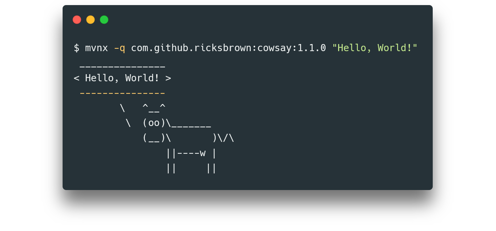

<h1 align="center">
  mvnx
</h1>

<h3 align="center">
  :coffee: :rocket:
<h3>

<h3 align="center">
  npx for maven repos | Execute JARs from maven repositories with no strings attached.
</h3>

  
  
  
  

  

**Table of Contents**

  * [Feautres](#features)
  * [Up and Running](#up-and-running)
    * [Using npx](#using-npx)
    * [Using npm -g](#using-npm--g)
    * [Using native executables](#using-native-executables)
  * [CLI Usage](#cli-usage)
    * [mxnx options](#mvnx-options)
    * [artifact](#artifact)
    * [artifact arguments](#artifact-arguments)
  * [Remote Repository Alias](#remote-repository-alias)
  * [Remote Repository Authentication](#remote-repository-authentication)
      * [Using Environment Variables](#using-environment-variables)
      * [Using mvnx.json](#using-mvnx.json)
      * [Using settings.xml and mvnx.json](#using-settings.xml-and-mvnx.json)
  * [Contributing](#contributing)
  * [License](#license)

## Features

mvnx is a JAR file executor with a catch: it obtains the JAR from local or remote Maven repositories.

  * **No Configuration Needed.** There's no need for convoluted configuration, XML files, DSLs and the usual ceremony of the JVM world. You just specifiy the Maven coordinates along with the command line arguments and mvnx will take care of the rest.
  * **Local Repository Caching.**  Artifact resolution starts in your local repository for maximum speed and minimal network usage. Downloaded artifacts are also cached in the local repository.
  * **Authentication Support.** mvnx supports HTTP Basic Authentication to remote maven repositories. This is required by repositories such as those of GitHub Packages. This feature needs a bit of a configuration though. See [Remote Repository Authentication](#remote-repository-authentication).
  * **Remote Repository Alias.** Remote repository URLs can be given aliases. If you set an alias, then you don't have to type `-r https://maven.pkg.github.com/OWNER/REPO` but the alias, for example `-r gpr::OWNER::REPO`. See [Remote Repository Alias](#remote-repository-alias).
  * **Latest Version Retrieval.** If you don't need a specific version of some artifact then mvnx will automatically get the latest available version. Just omit the version coordinate!

However, be aware of the following limitation:

  * Fat JARs only. mvnx will not perform dependency resolution.

## Up and Running

There's really not much to it, no matter which method you choose:

  * [Using npx](#using-npx)
  * [Using npm -g](#using-npm--g)
  * [Using native executables](#using-native-executables)

### Using npx

If you already have [Node](https://nodejs.org/en/) (and thus [npx](https://medium.com/@maybekatz/introducing-npx-an-npm-package-runner-55f7d4bd282b)) installed, you can run JARs using one command.

  1. **Execute your favorite JAR with some x-ception.**
     ~~~~
     npx mvnx com.github.ricksbrown:cowsay "Hello, World!"
     ~~~~

### Using npm -g

If you don't want to type npx over and over (or just want to get rid of the startup penalty of npx) then you can install mvnx [globally with npm](https://docs.npmjs.com/downloading-and-installing-packages-globally).

  1. **Install mvnx.**
     ~~~~
     npm install -g mvnx
     ~~~~

  2. **Execute your favorite JAR.**
     ~~~~
     mvnx com.github.ricksbrown:cowsay "Hello, World!"
     ~~~~

### Using native executables

If you're not a fan of Node then you might want to try the native executables published with each release:

  1. **Download the latest executable**
     * [Latest Release](https://github.com/mvnx/mvnx/releases/latest)
     * Native executables are offered for
       * Linux x64
       * Windows x64
       * MacOS x64

  2. **Execute your favorite JAR.**
     ~~~~
     mvnx com.github.ricksbrown:cowsay "Hello, World!"
     ~~~~

## CLI Usage

~~~~
mvnx [mvnx options] <artifact> [artifact arguments]
~~~~

### mvnx options:

  * **--quiet** **-q**
    * Suppress mvnx output (except for errors) and display output only from the JVM. Very useful when piping the output of mvnx.
  * **--java-executable** **-j**
    * Custom java executable path and options. By default, mvnx will use `java` and simply append `-jar somefilename`.
  * **--ignore-local**
    * Ignore pre-existing artifacts in the local repository and attempt to download the requested artifact from the remote repository. Downloaded artifacts will not be cached in the local repository.
    * The inverse of **--only-local**.
  * **--only-local**
    * Attempt to find the requested artifact in the local repository only. Will not make requests to any remote repository.
    * The inverse of **--ignore-local**.
  * **--local-repository** **-l**
    * Path to a local repository. Will attempt to use the default local repository ~/.m2 if missing.
  * **--remote-repository** **-r**
    * URL of a remote repository. Will use Maven Central by default.
  * **--help** **--h**
    * Display the help.
      ~~~~
      mvnx --help
      ~~~~

### artifact:

  * Usual maven coordinates in the following format:
    ~~~~
    <groupId>:<artifactId>[:version]
    ~~~~
  * If `version` is omitted, then mvnx will attempt to retrieve the latest version from the remote repository. Note, that this feature does not work if the `--only-local` flag is set.

### artifact arguments

  * The arguments you want to pass to the executed JAR.

## Remote Repository Alias

Makes sure to create an mvnx configuration file in your local maven directory. Note, that mvnx will search for the configuration file at `[local-repository]/mvnx.json` where `local-repository` is the value of the `--local-repository` option (`~/.m2` by default).

Thus, in the default case, simply create the file `~/.m2/mvnx.json`. Then, create the alias in the file:

~~~~JSON
{
  "servers": [
    {
      "id": "The alias you want to use.",
      "url": "The URL of the remote repository."
    }
  ]
}
~~~~

Now you're free to use the value of the `id` field instead of the URL.

## Remote Repository Authentication

For remote authentication using HTTP Basic, you have three options:

  * [Using Environment Variables](#using-environment-variables)
  * [Using mvnx.json](#using-mvnx.json)
  * [Using settings.xml and mvnx.json](#using-settings.xml-and-mvnx.json)

### Using Environment Variables

Simply set the following two environment variables:

  * `MVNX_REMOTE_USERNAME`,
  * `MVNX_REMOTE_PASSWORD`

Ideal for CI workflows.

### Using mvnx.json

You can also set the credentials in the mvnx configuration file (usually located at `~/.m2/mvnx.json`, see [Remote Repository Alias](#remote-repository-alias) for more details) as follows:

~~~~JSON
{
  "servers": [
    {
      "url": "The URL of the remote repository.",
      "username": "Username for the repository.",
      "password": "Password for the repository."
    }
  ]
}
~~~~

You may also set an `id` if you want to use an alias. Going forward, mvnx will always use the specified credentials if the appropriate remote repository is queried.

This approach works best if

  * you don't have maven installed,
  * or maven is available but you don't want to tinker with the maven `settings.xml`.

### Using settings.xml and mvnx.json

Let's assume, that you already have the following server in your `settings.xml`:

~~~~XML
<server>
  <id>some-server</id>
  <username>user</username>
  <password>pw</password>
</server>
~~~~

In this case, to re-use these credentials, instead of copy-pasting them, you can create the following mvnx configuration entry:

~~~~JSON
{
  "servers": [
    {
      "id": "some-server",
      "url": "The URL of the remote repository."
    }
  ]
}
~~~~

By using the same id in both the `settings.xml` and the `mvnx.json`, mvnx will be able to load the appropriate credentials.

This approach is great if you don't want to set credentials twice.

## Contributing

Contributions, regardless of their type, are always welcome in mvnx! Take a look at the [Contributing Guide](CONTRIBUTING.md) for more information.

## License

Licensed under the [Apache License 2.0](LICENSE).
